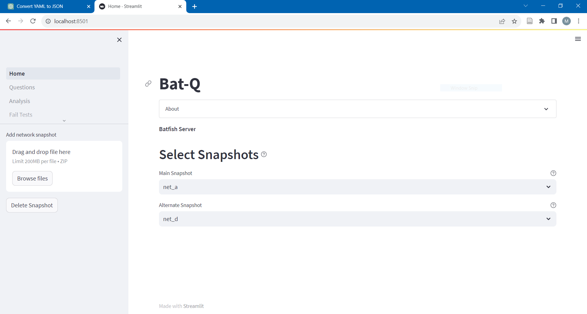
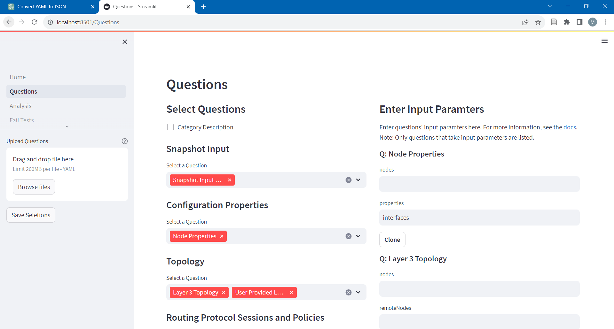
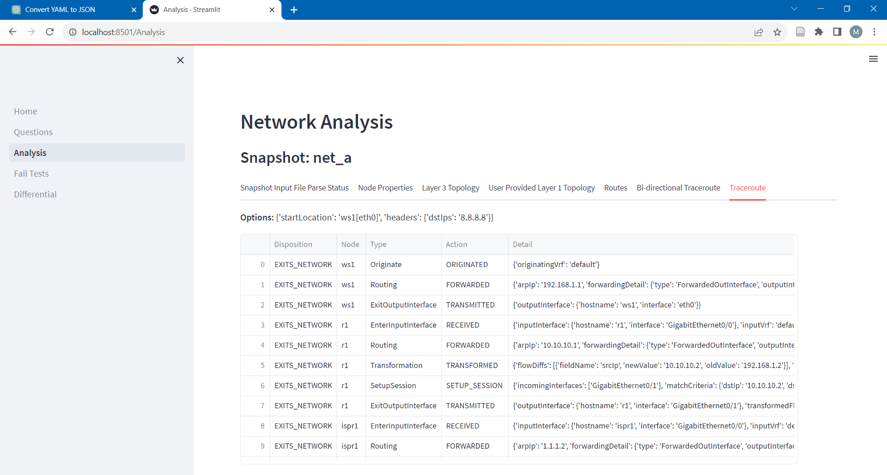
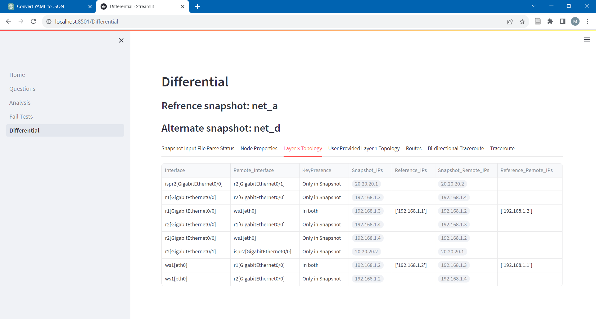

# Bat-Q: Network Analyzer with Batfish

This is a Streamlit app that allows you to run network analysis queries using [Batfish](https://www.batfish.org/). The app allows you to select Batfish questions by category and name. The app runs the selected questions and displays the results in table format.

## Installation

First, make sure that you have Python 3.6+ and pip installed. Then, you can install the required packages by running:

```bash
pip3 install -r requirements.txt
```


## Getting Started

To use the app, follow these steps:

1. Install Batfish and run the Batfish services using these [instructions](https://github.com/batfish/batfish)

3. Clone this repository:

    ```bash
    git clone https://github.com/martimy/Bat-Q
    cd Bat-Q
    ```

2. Set the environment variable:  BATFISH_SERVER=\<Batfish server IP address\>

3. Start the Streamlit app:

    ```bash
    streamlit run Home.py
    ```

    This will open a Streamlit app in your default web browser.

## Usage


### Home page

At the Home page, you can upload the your network configuration files as .zip file. You can upload multiple configuration files. Batfish treats these files as network snapshots. The snapshots can be of the same network at different states or of different networks. Make sure you select one snapshot to be the active snapshot. You may also select another snapshot for comparisons.



### Questions page

The Questions page displays (almost) all of the Batfish question grouped in categories. Select the questions you would like to use from the left side of the main screen. The right side of the main screen shows input fields for the selected questions. Most questions accept optional input parameters so there is no need to specify these parameters. Mandatory parameters are denoted by an asterisk.

Use the side bar to save the selected questions (in the Downloads folder, by default). You can also upload previously saved questions from YAML file.



### Analysis page

The Analysis pages shows the answers to the selected questions. Most answers are shown in table format. Bat-Q tries to remove all empty table columns. These removed columns are listed below the table. Topology questions include also a simple diagram of the topology.



### Failure Tests page

Batfish allows you to test various network failure scenarios by disabling any number of nodes and/or interfaces in the network. The failed components are included in forked snapshot that Bat-Q assigns a name  in the format "<snapshot>_fail".

Once the failed components are selected, answers to the selected questions will reflect the new state of the network. You can move back-and-forth between the Analysis page and the Failure Tests pages, or even add/delete/modify questions using the Questions pages, as many times as you wish.


### Differential page

You can compare two snapshots by select them from the Home page. The Differential shows the answers to the same selected questions but in a slightly different format where the results are shown to belong to the first (Reference) snapshot, the second, or both.

Note that most Batfish questions can be used for single or two snapshots. There are only two questions that can be used for comparisons only.



## Limitations

Bat-Q is not a substitute for pyBatfish, which you will still need to use to get the full power of Batfish. Bat-Q is useful for quick configuration analysis or when writing custom Python code for the network analysis is inefficient or infeasible.
