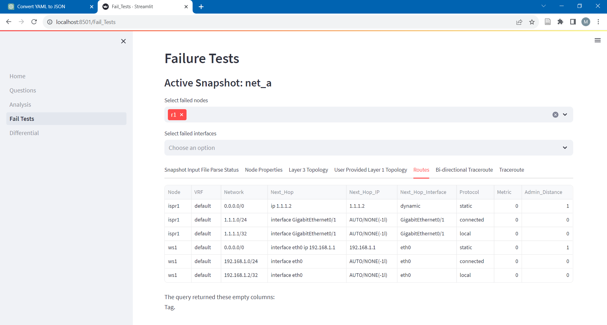

# Bat-Q: A Streamlit App for Network Analysis with Batfish

Bat-Q is a [Streamlit](https://streamlit.io/) app that lets you run various network analysis queries using [Batfish](https://www.batfish.org/), an open source network configuration analysis tool. You can upload your network configuration files as snapshots and analyze different scenarios or states. You can also select from a wide range of Batfish [questions](https://pybatfish.readthedocs.io/en/latest/index.html) to get insights into your network's behavior and security. Bat-Q displays the answers in tables and diagrams for easy interpretation.

Bat-Q is designed to be simple, interactive, and flexible. You can use it for quick network configuration checks or for network troubleshooting and optimization tasks. Bat-Q is not a replacement for [pyBatfish](https://github.com/batfish/pybatfish), the Python API for Batfish, but rather a complementary tool that can help you get started with network analysis using Batfish.


To learn more about Bat-Q and how to use, please watch these [YouTube tutorials](https://www.youtube.com/playlist?list=PLcWqK41-5YzIpiT223KToro0iaTww-58t) (work in progress).

## Requirements

To use Bat-Q, you will need:

- A Batfish server capable of running Docker: See the recommended [requirements for Batfish](https://batfish.readthedocs.io/en/latest/system_req.html).
- A host to run the Bat-Q app.

Note that for training purposes with small networks, you can use one computer to run both Batfish and Bat-Q (a reasonable laptop will work).

## Installation

To use the app, follow these steps (assuming Ubuntu Linux, but Windows also works):

### Batfish server

1. Install Docker:

    There are multiple methods, but I recommend using [the apt repository method](https://docs.docker.com/engine/install/ubuntu/#install-using-the-repository).

2. To use Docker as a non-privileged user, add the user to the Docker group:

    ```bash
    $ sudo usermod -aG docker $USER
    ```

3. Install Batfish and run the Batfish services:

    ```bash
    $ docker pull batfish/allinone
    $ docker run --name batfish -d --restart unless-stopped -v batfish-data:/data -p 9997:9997 -p 9996:9996 batfish/allinone
    ```

    This is all it is needed for Bat-Q but you can consult these [Batfish installation instructions](https://github.com/batfish/batfish) for other details.

### Bat-Q host

1. Check Python version and install pip3. Bat-Q needs Python 3.8+:

    ```bash
    $ python3 --version
    $ sudo apt-get install python3-pip
    ```

1. Clone this repository:

    ```bash
    git clone https://github.com/martimy/Bat-Q
    cd Bat-Q
    ```

2. Install Streamlit and other requirements

    ```bash
    pip3 install -r requirements.txt
    ```

4. Set the environment variable (skip this step if Docker and Streamlit are running on the same machine):

    ```bash
    $ export BATFISH_SERVER=<Batfish server IP address>
    $ echo $BATFISH_SERVER
    ```

5. Start the Streamlit app (you may need to re-login before this step):

    ```bash
    $ streamlit run Home.py
    ```

    This will open a Streamlit app in your default web browser. If the browser does not open automatically or if you are using a remote machine, open a browser and direct it to http://\<Bat-Q host\>:8501/

## Getting Started


### Home page

At the Home page, you can upload the your network configuration files as .zip file. You can upload multiple configuration files. Batfish treats these files as network snapshots. The snapshots can be of the same network at different states or of different networks. Make sure you select one snapshot to be the active snapshot. You may also select another snapshot for comparisons.


### Questions page

The Questions page displays (almost) all of the Batfish questions grouped in categories. Select the questions you would like to use from the left side of the main screen. The right side of the main screen shows input fields for the selected questions. Most questions accept optional input parameters so there is no need to specify these parameters. Mandatory parameters are denoted by an asterisk.

Use the side bar to save the selected questions (in the Downloads folder, by default). You can also upload previously saved questions from YAML file.


### Analysis page

The Analysis pages shows the answers to the selected questions. Most answers are shown in table format. Bat-Q tries to remove all empty table columns. These removed columns are listed below the table. Topology questions include also a simple diagram of the topology.


### Failure Tests page

Batfish allows you to test various network failure scenarios by disabling any number of nodes and/or interfaces in the network. The failed components are included in forked snapshot that Bat-Q assigns a name in "\<snapshot>_fail" format.

Once the failed components are selected, answers to the selected questions will reflect the new state of the network. You can move back-and-forth between the Analysis page and the Failure Tests pages, or even add/delete/modify questions using the Questions pages, as many times as you wish.



### Differential page

You can compare two snapshots by selecting them from the Home page. The Differential page shows the answers to the same selected questions but in a slightly different format where the results are shown to belong to the first (Reference) snapshot, the second, or both.

Note that most Batfish questions can be used for single or two snapshots. There are only two questions that can be used for comparisons only.


## Limitations

Bat-Q is not a substitute for pyBatfish, which you will still need to use to get the full power of Batfish. Bat-Q is useful for quick configuration analysis or when writing custom Python code for the network analysis is inefficient or infeasible.
